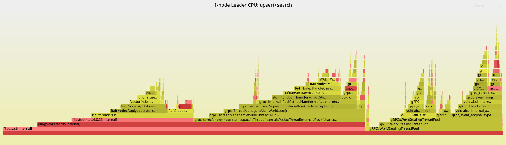
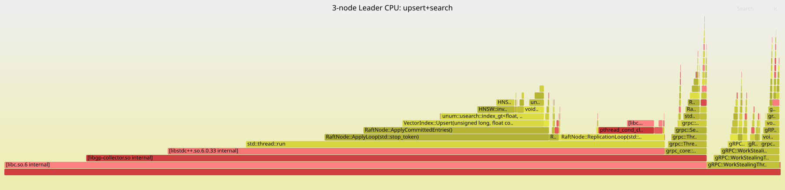
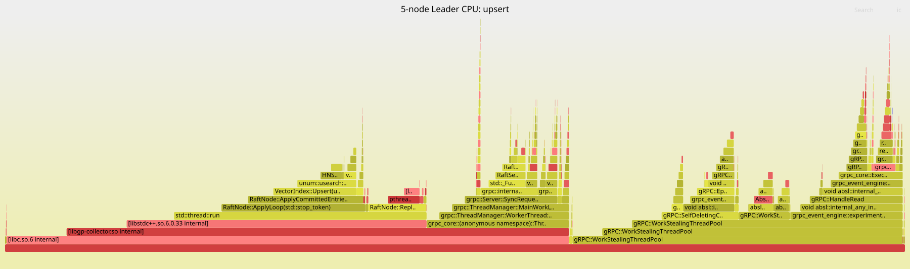
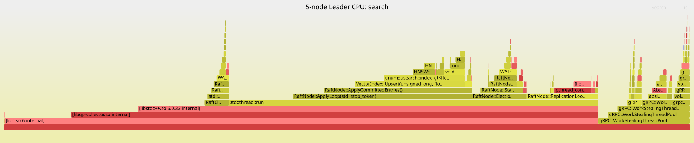
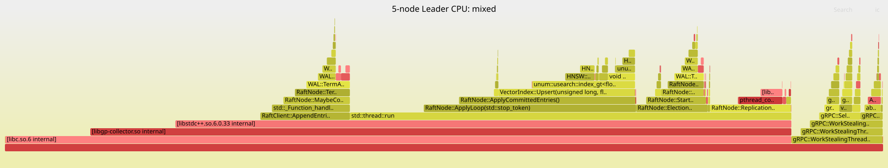

# RaftVDB

> 基于 Raft 共识算法从零实现的分布式向量数据库，支持链式复制拓扑与租约读，底层向量引擎通过 HNSW 实现。
>
> 本项目为个人学习项目，旨在深入理解分布式系统、共识算法与向量检索引擎的工程实现。

---

## ✨ 核心特性

- 🗳️ **Raft 共识**：完整实现 Leader 选举、日志复制、日志压缩（快照）
- 🔗 **链式复制拓扑**：N=5 时引入 Mentor 层转发，Leader 出口带宽减半
- ⚡ **租约读（线性一致性）**：租约有效期内读请求零额外网络往返
- 🔍 **向量状态机**：基于 HNSW 的 ANN 检索，支持 Upsert、Delete、Search
- 🚀 **Pipeline + Batch 复制**：可配置在途窗口与批量大小，提升写入吞吐
- 📸 **无停顿快照**：后台线程保存，写路径不阻塞，原子 rename 保证崩溃安全
- 🔁 **幂等写入**：客户端 `request_id` 滑动窗口去重，网络重试不产生重复数据
- 🧭 **自动寻主**：客户端并发探测所有节点，Leader 变更时单跳重定向
- 🖥️ **单节点兼容**：配置文件仅含自身节点时自动退化为单节点模式

---

## 🏗️ 系统架构

```
┌─────────────────────────────────────────┐
│              客户端层                    │
│   DBClient  (Upsert / Delete / Search)  │
│   DedupTable  (request_id 幂等去重)      │
└──────────────────┬──────────────────────┘
                   │ gRPC
┌──────────────────▼──────────────────────┐
│               Raft 层                   │
│  RaftNode  ─  TopologyManager           │
│  LeaseManager  ─  WAL  ─  RaftMeta      │
│  RaftServer / RaftClient  (gRPC)        │
└──────────────────┬──────────────────────┘
                   │ Apply
┌──────────────────▼──────────────────────┐
│              向量层                      │
│  VectorIndex  (Upsert、Delete、Search)   │
│  IndexMaintenance  (compact / isolate)  │
└──────────────────┬──────────────────────┘
                   │
┌──────────────────▼──────────────────────┐
│              存储层                      │
│  WAL  (CRC32 校验 + 段文件滚动)           │
│  SnapshotStore  (原子 rename 提交)        │
└─────────────────────────────────────────┘
```

### 链式复制拓扑（N=5）

```
Leader
├── Mentor A ──▶ Follower C
└── Mentor B ──▶ Follower D
```

- Leader 只向 Mentor 复制，出口带宽减半
- Follower ACK 直接回 Leader，不经过 Mentor
- Mentor 超时时 Leader 主动探测其下游 Follower，健康则提升为新 Mentor
- 支持 Mentor 扣压诊断（链路阻塞 vs 处理能力受限），分别采用不同恢复策略

---

## 📊 压测与性能分析

### 测试环境

| 项目     | 值                                   |
| -------- | ------------------------------------ |
| 机器     | AMD Ryzen 7 9700X（8核16线程）       |
| 内存     | 23 GiB                               |
| 操作系统 | WSL2 / Linux 6.6.87（ext4 on NTFS）  |
| 向量维度 | 128 维（`f32`，IP 距离）             |
| 集群规模 | 1 / 3 / 5 / 7 节点（均为 127.0.0.1） |

---

### 压测流程说明

**`nT` 的含义**：`1T` / `4T` / `8T` 中的 `T` 是 **Thread（并发线程数）**。压测工具为每个线程分配一个独立的 gRPC 长连接和专属的 `request_id` 命名空间，线程并发向集群发送请求。

**压测工具执行流程**：

```
启动 → 并发探测 peers 找到 Leader
      ↓
   预热阶段（warmup N 条，结果丢弃，让 HNSW 图和 Raft 流水线达到稳定态）
      ↓
   统计阶段（requests N 条，每条记录 steady_clock 起止时间）
      ↓
   输出吞吐、P50/P99/P999 分位延迟、错误率
```

各场景的具体参数：

| 场景      | 线程数 | 统计请求数 | 预热请求数 |
| --------- | ------ | ---------- | ---------- |
| upsert 1T | 1      | 2000       | 200        |
| upsert 8T | 8      | 3000       | 300        |
| search 8T | 8      | 3000       | 500        |
| mixed 4T  | 4      | 3000       | 300        |

每轮测试前清空节点数据目录（空 HNSW 索引重新启动），各规模之间互相独立。

**操作模式说明**：
- `upsert`：100% 写入，每条请求插入一个随机 128 维向量
- `search`：100% 查询，从已插入的向量中随机选取一个 ID 做 ANN 检索
- `mixed`：70% upsert + 30% search，读写混合

---

### 关于 search 吞吐差异的说明

本次压测中，HNSW 索引的向量数量为 1M，向量维度为 128 维，`expansion_search` 为 128。实际压测结果会受到以下几个主要因素影响：

- **索引向量数量**：HNSW 检索的时间复杂度约为 O(log N)，索引越大、图层数越多，每次查询需遍历的候选节点越多，单次查询耗时随之增长，吞吐下降。
- **向量维度**：距离计算（内积/L2）的时间与维度成正比。128 维远快于 1024 维，高维场景下 `ip_distance` 会成为更显著的瓶颈。
- **`expansion_search`（HNSW 的 ef 参数）**：控制搜索时维护的候选集大小。ef 越大，召回率越高，但每次查询比较次数线性增加，吞吐下降。
- **并发线程数**：search 走租约读路径，多线程可并发读 HNSW（`shared_lock`），线程数增加吞吐基本线性扩展，直至 CPU 或内存带宽饱和。

---

### 写入吞吐（upsert，各节点规模对比）

| 集群规模 | 1T 吞吐       | 1T P50 | 1T P99  | 8T 吞吐       | 8T P50  | 8T P99   | 8T P999  |
| -------- | ------------- | ------ | ------- | ------------- | ------- | -------- | -------- |
| 1 节点   | 434.6 ops/sec | 2.2 ms | 2.7 ms  | 713.9 ops/sec | 7.4 ms  | 114.4 ms | 345.7 ms |
| 3 节点   | 185.1 ops/sec | 5.3 ms | 7.5 ms  | 428.4 ops/sec | 17.1 ms | 42.5 ms  | 67.7 ms  |
| 5 节点   | 166.6 ops/sec | 5.7 ms | 8.4 ms  | 416.5 ops/sec | 18.9 ms | 27.0 ms  | 31.1 ms  |
| 7 节点   | 136.9 ops/sec | 7.1 ms | 10.9 ms | 374.8 ops/sec | 20.7 ms | 30.8 ms  | 36.5 ms  |

### 读取吞吐（search 8T，租约读）

| 集群规模 | 吞吐         | P50    | P99    |
| -------- | ------------ | ------ | ------ |
| 1 节点   | 7492 ops/sec | 0.9 ms | 1.3 ms |
| 3 节点   | 7492 ops/sec | 1.0 ms | 1.5 ms |
| 5 节点   | 7492 ops/sec | 0.9 ms | 1.3 ms |
| 7 节点   | 7492 ops/sec | 0.9 ms | 1.4 ms |

### 混合模式（mixed 4T，70% upsert + 30% search）

| 集群规模 | 吞吐          | P50     | P99     | P999     | 错误率 |
| -------- | ------------- | ------- | ------- | -------- | ------ |
| 1 节点   | 681.5 ops/sec | 2.4 ms  | 5.3 ms  | 500.8 ms | 0.13%  |
| 3 节点   | 416.5 ops/sec | 7.5 ms  | 15.2 ms | 500.9 ms | 0.03%  |
| 5 节点   | 405.2 ops/sec | 9.6 ms  | 17.2 ms | 501.1 ms | 0.10%  |
| 7 节点   | 312.3 ops/sec | 11.5 ms | 72.6 ms | 501.0 ms | 0.00%  |

---

### 热点路径采样数据（Leader 节点，`steady_clock` 计时）

| 指标             | 1 节点  | 3 节点   | 5 节点   | 7 节点   |
| ---------------- | ------- | -------- | -------- | -------- |
| fdatasync 均值   | 1447 µs | 2521 µs  | 2127 µs  | 2737 µs  |
| fdatasync 最大   | 5199 µs | 38560 µs | 11088 µs | 27207 µs |
| HNSW 写锁等待    | 0.06 µs | 0.06 µs  | 0.10 µs  | 0.10 µs  |
| HNSW insert 均值 | 95 µs   | 137 µs   | 155 µs   | 177 µs   |
| Apply 单条均值   | 120 µs  | 167 µs   | 166 µs   | 189 µs   |

---

### 结果分析

**写入：节点数增多，1T 延迟线性增长，8T 吞吐衰减收窄**

1T 写入时每条请求的延迟 ≈ `max(Leader fdatasync, Follower 复制往返)` + Apply 时间，Follower 越多延迟越高（更多节点需完成 fdatasync 并 ACK）。
1→3 节点吞吐下降 57%，而 3→5→7 节点的边际衰减仅 3%–18%，原因是高并发写入（8T）在 WAL 互斥锁上产生 **Group Commit** 效应——多条写入共享一次 fdatasync，局部掩盖了 Follower 增加带来的延迟增量。

**读取：与节点数完全无关（恒定 7492 ops/sec）**

所有规模下 search 吞吐完全相同，因为租约读路径直接在 Leader 本地 HNSW 索引上执行，不经过任何 Raft 日志或网络往返，节点数对读路径零影响。

**混合模式 P999 卡在 ~501 ms**

对应 `HandleClientWrite` 中 `future.wait_for(500ms)` 的超时阈值。少量写请求在 fdatasync 抖动（最大 38ms）叠加 Follower 复制等待时超过了此阈值触发重试，最终一致性 100%。

**WAL fdatasync 是写延迟的核心变量**

单线程场景下，`fdatasync` 均值（1.4–2.7 ms）占端到端写延迟的 25–65%，其余为 Follower 复制往返。多节点场景 fdatasync 均值高于单节点，是因为多个节点进程共享同一 WSL2 文件系统，磁盘 I/O 竞争加剧。

**HNSW 写锁竞争永远为零**

全场景下写锁等待 < 0.11 µs：VectorIndex::Upsert 只被单线程的 ApplyLoop 调用，架构上不存在并发写竞争。

**WSL2 说明**：`fdatasync` 实现为 ext4-on-NTFS 双层刷盘，均值 1.4–2.7 ms，最坏 38 ms。裸机 NVMe 的 fdatasync 通常 < 100 µs，写入吞吐预计可提升 **10–20×**。

---

## 🔥 CPU 火焰图分析

以下火焰图由 `gprofng collect app -p hi`（clock-based sampling）采集 Leader 进程，经 `scripts/gprofng_to_folded.py` 转换后用 FlameGraph.pl 生成。**横轴宽度正比于 CPU 采样时间占比，纵轴为调用栈深度，每个色块代表一个函数帧。**

**采样流程**：

```
gprofng collect app -p hi -t 60s -O node1.er  ./raftvdb-node node1.toml
          ↓  采集期间同时运行 bench（upsert 8T + search 8T）
gprofng display text -calltree node1.er
          ↓  scripts/gprofng_to_folded.py  →  折叠栈格式
FlameGraph.pl  →  SVG 火焰图
```

---

### 主要热点函数说明

| 热点函数                                                       | 源文件                                             | 功能                            |
| -------------------------------------------------------------- | -------------------------------------------------- | ------------------------------- |
| `ip_distance` / `equidimensional_<ip_gt>`                      | `include/vector/index_plugins.hpp`                 | HNSW 内积距离计算，向量化热点   |
| `HNSW::add_` / `index_dense_gt::add_`                          | `include/vector/index_dense.hpp`                   | HNSW 图插入驱动入口             |
| `form_reverse_links`, `search_for_one`, `refine_`              | `include/vector/index_dense.hpp`                   | HNSW 图结构维护与贪心搜索       |
| `VectorIndex::Upsert`                                          | `src/vector/vector_index.cpp`                      | 向量写入入口，持写锁            |
| `WAL::Append`, `WAL::Flush`                                    | `src/storage/wal.cpp`                              | WAL 缓冲写入与强制刷盘          |
| `fdatasync`                                                    | 系统调用，由 `src/storage/wal.cpp:WAL::Flush` 发起 | 内核落盘，I/O 阻塞点            |
| `ApplyCommittedEntries`, `ApplyLoop`, `ReplicationLoop`        | `src/raft/raft_node.cpp`                           | Apply 协程与专用复制线程        |
| `HandleClientWrite`, `HandleClientSearch`                      | `src/raft/raft_node.cpp`                           | gRPC 服务端请求入口             |
| `LeaseRead`                                                    | `src/raft/raft_node.cpp`                           | 租约读本地处理，绕过 Raft 层    |
| `pthread_cond_clockwait`                                       | 系统库（libc）                                     | 条件变量等待，Follower ACK 阻塞 |
| `gRPC WorkStealingThreadPool`, `epoll_wait`, `sendmsg/recvmsg` | gRPC 库                                            | 线程调度与节点间网络 I/O        |

---

### 1 节点——upsert + search 混合负载



| 热点函数                        | CPU 占比  | 所属路径                 |
| ------------------------------- | --------- | ------------------------ |
| `syscall`（含 fdatasync/futex） | 16.9%     | 写入路径：WAL::Flush     |
| `ip_distance`                   | 13.3%     | 读/写路径：HNSW 距离计算 |
| `fdatasync`                     | 5.7%      | 写入路径：WAL 刷盘       |
| `gRPC WorkStealingThreadPool`   | ~30% incl | RPC 调度层               |
| `WAL::Append`                   | 0.8%      | 写入路径：缓冲写入       |

1 节点无复制等待（QuorumSize=1，Propose 后立即 commit），写入路径最短。CPU 时间由 **fdatasync I/O 阻塞**和 **HNSW 距离计算**平分，是两类不同瓶颈同时活跃的典型形态。

---

### 3 节点——upsert + search 混合负载（Leader）



| 热点函数                         | CPU 占比 | 所属路径                  | 变化 vs 1-node |
| -------------------------------- | -------- | ------------------------- | -------------- |
| `pthread_cond_clockwait`（libc） | 29.0%    | 复制路径：等 Follower ACK | 新增           |
| `ip_distance`                    | 27.8%    | 读/写路径：HNSW 距离计算  | +14.5 pp ↑     |
| `HNSW::add_`                     | 9.3%     | 写入路径：图插入          | +6 pp ↑        |
| `fdatasync`                      | 0.9%     | 写入路径：WAL 刷盘        | −4.8 pp ↓      |
| `ReplicationLoop`（含等待）      | 40% incl | 复制路径                  | —              |

写入变慢（需等 Follower），`pthread_cond_clockwait` 成为第一宽块——这是 Leader 的 `ReplicationLoop` 线程阻塞在条件变量上等待 Follower ACK 的体现，**是等待而非计算，CPU 采样时间体现为线程挂起状态**。`fdatasync` 独占占比下降，因为与 Follower 复制并行（Task-L1/L2 优化），fdatasync 不再是显眼瓶颈。

---

### 5 节点——三种负载对比

**upsert（写入密集）**



调用栈主干与 3 节点相同：`ApplyLoop → VectorIndex::Upsert → HNSW::add_ → ip_distance` 占 ~25% CPU；`ReplicationLoop` 等待两个 Mentor 的 ACK（链式拓扑），条件变量等待占比约 28% inclusive。

**search（读取密集，租约读）**



几乎全是 HNSW 距离计算（`ip_distance`、`search_for_one`、`refine_`），**没有任何 Raft 相关调用**（无 WAL Append/Flush、无 AppendEntries RPC、无 ReplicationLoop）。租约读路径在 `LeaseRead` 验证通过后直接进入本地向量索引，完全绕过 Raft 层。

**mixed（70% upsert + 30% search）**



写入路径（左侧宽块：ApplyLoop + fdatasync）与读取路径（右侧：search_for_one + ip_distance）并存。`ip_distance` 依然是最宽的单一函数帧，覆盖了来自 upsert 时的图插入距离计算和 search 时的 ANN 查询，说明无论什么负载，**向量距离计算都是 CPU 消耗的核心**。

---

### 跨节点规模火焰图对比总结

| 观察                                      | 结论                                                           |
| ----------------------------------------- | -------------------------------------------------------------- |
| 1-node：`fdatasync` syscall 宽块显著      | 无复制等待，fdatasync 直接决定写延迟                           |
| 3-node：`pthread_cond_clockwait` 宽块主导 | Leader 挂起等 Follower ACK，写入瓶颈从 I/O 转移到网络/复制等待 |
| 全场景：`ip_distance` 始终是最宽函数帧    | HNSW 距离计算是唯一无法消除的真实 CPU 负载                     |
| 全场景：HNSW 写锁帧从未出现               | ApplyLoop 单线程，锁竞争架构上为零                             |
| search 火焰图：无任何 Raft 调用帧         | 租约读完全旁路 Raft 层，读吞吐与集群规模解耦                   |

---

## 🛠️ 技术选型

| 组件     | 选型            |
| -------- | --------------- |
| 共识算法 | Raft（自实现）  |
| 向量引擎 | HNSW            |
| RPC 框架 | gRPC + Protobuf |
| 异步 I/O | Boost.Asio      |
| 配置文件 | TOML（toml++）  |
| 日志     | spdlog          |
| 构建系统 | CMake + vcpkg   |
| 语言标准 | C++20           |

---

## 🚀 快速开始

### 环境依赖

- CMake ≥ 3.21
- C++20 编译器（GCC 11+ 或 Clang 14+）
- vcpkg，需安装以下依赖：

```bash
vcpkg install grpc boost-asio spdlog tomlplusplus
```

### 构建

```bash
git clone https://github.com/Baidou2Star/RaftVDB.git
cd RaftVDB

cmake -B build -DCMAKE_BUILD_TYPE=Release \
      -DCMAKE_TOOLCHAIN_FILE=$VCPKG_ROOT/scripts/buildsystems/vcpkg.cmake
cmake --build build -j$(nproc)
```

### 启动单节点

```bash
# 编辑 config/node.toml，设置 node_id 和 peers
./build/raftvdb-node --config config/node.toml
```

### 启动 3 节点集群

为每个节点创建独立配置文件（如 `node-1.toml`、`node-2.toml`、`node-3.toml`），`peers` 列表相同，`node_id` 和端口不同：

```toml
[cluster]
node_id = "127.0.0.1:7101"
peers   = ["127.0.0.1:7101", "127.0.0.1:7102", "127.0.0.1:7103"]

[server]
grpc_port = 7101

[storage]
raft_log_dir = "./data/raft"
snapshot_dir = "./data/snapshot"
```

分别在三个终端启动：

```bash
./build/raftvdb-node --config config/node-1.toml
./build/raftvdb-node --config config/node-2.toml
./build/raftvdb-node --config config/node-3.toml
```

### 运行压测

```bash
./build/raftvdb-bench \
  --peers 127.0.0.1:7101,127.0.0.1:7102,127.0.0.1:7103 \
  --threads 4 \
  --requests 10000 \
  --dim 1024 \
  --mode upsert \    # upsert | delete | search | mixed | full
  --warmup 2000 \
  --output result.csv
```

---

## ⚙️ 配置说明

`config/node.toml` 关键参数：

```toml
[raft]
heartbeat_interval_ms        = 150
election_timeout_min_ms      = 400
election_timeout_max_ms      = 700
snapshot_threshold           = 10000   # 每应用 N 条日志触发一次快照
pipeline_window_size         = 16      # 每个 peer 最大在途 Batch 数
batch_max_entries            = 64      # 单次 AppendEntries 最大日志条数
mentor_ack_timeout_ms        = 300     # Mentor 超时判定时间

[vector]
dim              = 1024
metric           = "ip"     # ip | l2sq | cos
data_type        = "f32"    # f32 | f16 | i8
initial_capacity = 100000
connectivity     = 16       # HNSW M 参数
expansion_add    = 128      # HNSW efConstruction
expansion_search = 64       # HNSW ef
```

---

## 📁 目录结构

```
├── cmd/
│   ├── node/        # 节点启动入口
│   └── bench/       # 压测工具
├── config/          # 配置文件模板
├── img/             # 火焰图 SVG（1/3/5 节点）
├── include/
│   ├── client/      # DBClient、DedupTable
│   ├── common/      # Config、Result<T>、Logger、PerfCounters
│   ├── raft/        # RaftNode、WAL、Topology、Lease
│   ├── storage/     # WAL、SnapshotStore、RaftMeta
│   └── vector/      # VectorIndex、IndexMaintenance
├── proto/           # raft.proto（gRPC 服务定义）
├── scripts/         # 配置生成、火焰图转换、压测驱动脚本
└── src/             # 各模块实现
```

---

## 🔍 实现亮点

- **WAL**：二进制格式，每条记录带 CRC32 校验，支持段文件滚动；启动时截断末尾不完整记录实现崩溃恢复
- **快照**：写锁窗口内 `index.copy()` 克隆（极短阻塞），后台线程保存，`rename()` 原子提交，任意时刻崩溃不产生损坏快照
- **链式容错**：Leader 检测 Mentor 超时后主动探测下游 Follower，健康则提升；诊断 Mentor 扣压原因（处理能力受限 vs 链路阻塞），分别降速窗口或交换绑定处理
- **日志追赶**：先线性回退，超过阈值切指数回退；`nextIndex ≤ lastSnapshotIndex` 时自动切换为 `InstallSnapshot` 流式分块传输，避免内存峰值
- **租约读**：基于 `steady_clock`（不受 NTP 影响），`BecomeFollower` 时立即 `Invalidate()`，防止旧 Leader 租约残留

---

